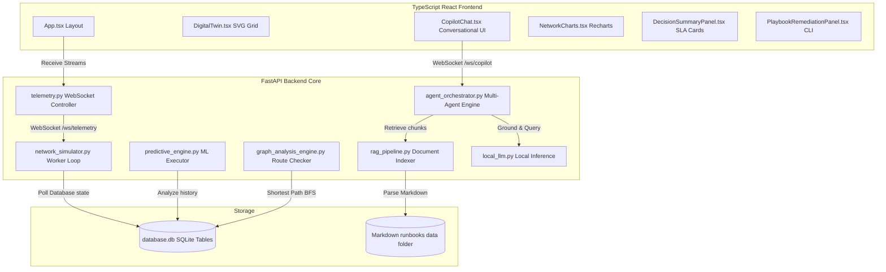
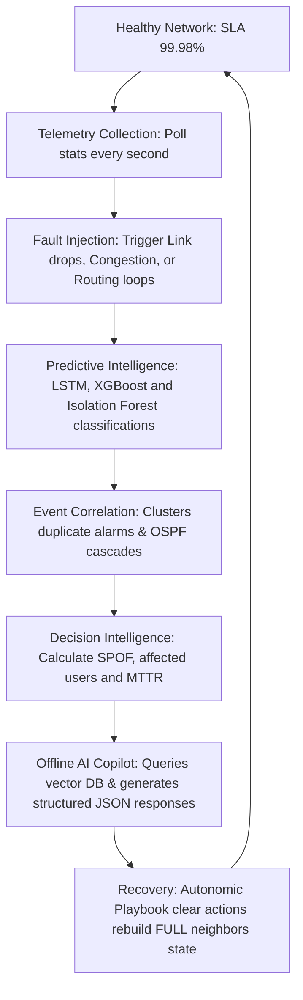

# 🛰️ INCOSPAR Nexus AI
### Air-Gapped Predictive Digital Twin & Autonomous AI NOC Copilot

---

<p align="center">
  
</p>

<p align="center">
  
  
  
  
  
  
  
</p>

---

## 📖 Table of Contents
1. [Introduction](#-introduction)
2. [Features](#%EF%B8%8F-features)
3. [Architecture](#-architecture)
4. [System Workflow](#-system-workflow)
5. [Screenshots](#-screenshots)
6. [Technology Stack](#-technology-stack)
7. [Project Structure](#-project-structure)
8. [AI Architecture](#-ai-architecture)
9. [REST APIs](#-rest-apis)
10. [WebSocket APIs](#-websocket-apis)
11. [Installation](#-installation)
12. [Running the Project](#-running-the-project)
13. [Demo Scenario](#-demo-scenario)
14. [Results](#-results)
15. [Future Scope](#-future-scope)
16. [Team](#-team)
17. [License](#-license)
18. [Acknowledgements](#-acknowledgements)

---

## 🚀 Introduction

**INCOSPAR Nexus AI** is an enterprise-grade AIOps platform and Network Operations Center (NOC) assistant engineered specifically for secure, air-gapped, and offline mission-critical environments. Modern operations—such as space agency command centers, satellite tracking networks, and launchpad ground control grids—require high-availability network infrastructures that operate in complete network isolation (no internet, no external APIs, and no cloud-dependent services).

### The ISRO Problem Statement
Dynamic telemetry loops, multi-site SD-WAN interfaces, and routing adjacencies generate thousands of disjointed events, making troubleshooting difficult and causing alert fatigue. Conventional AIOps platforms rely on external cloud models, which risk telemetry leakage and fail during cloud service drops.

### Our Solution
INCOSPAR Nexus AI bridges this gap. It implements a **Predictive Digital Twin** that models dynamic paths, link availabilities, and OSPF/BGP neighbor routers. Powered by a hybrid machine learning pipeline (LSTM, XGBoost, and Isolation Forest), topological graph analysis, and a local Retrieval-Augmented Generation (RAG) agent workflow, it predicts network anomalies, clusters cascading alarms, calculates the downstream blast radius, and suggests runbook playbooks—all processed locally on edge hardware.

---

## ⚡ Features

| Module | Feature | Capability & Implementation Details | Status |
| :--- | :--- | :--- | :--- |
| **Digital Twin** | React Flow Adjacency Map | Live SVG graph mapping nodes, overlay weights, routing metrics, and link status. | Implemented |
| **Telemetry** | Live Telemetry Stream | Real-time WebSocket transmission of CPU, bandwidth, latency, jitter, loss, and error rates. | Implemented |
| **ML Engine** | Multi-Model Predictive Pipeline | LSTM for congestion times, XGBoost for tunnel failures, Isolation Forest for multivariate anomalies. | Implemented |
| **XAI** | Explainable AI Cards | Dynamic z-score calculations that map ML features to natural-language explanation cards. | Implemented |
| **Blast Radius** | Topological Blast Radius | Breadth-First Search (BFS) reachability checks to map downstream nodes, users, and SPOFs. | Implemented |
| **Correlation** | Alert Clustering & Deduplication | Clusters syslog logs and alerts to reduce alarm noise and trace cascading failures. | Implemented |
| **Playbooks** | Autonomic Playbook Execution | Interactive checklist consoles displaying CLI recovery scripts (OSPF configs, IPSec resets). | Implemented |
| **RAG** | Swappable RAG vector DB | Indexing of local runbooks using ChromaDB/FAISS, with a NumPy/Scikit-Learn TF-IDF fallback. | Implemented |
| **Copilot** | Structured Response AI Copilot | Local Ollama support (Llama3/Phi3) with an offline rule fallback that returns structured JSON. | Implemented |
| **Simulations** | What-If Outage Simulator | Simulated outage scenarios on any node to predict blast radius percentages and downtimes. | Implemented |

---

## 🏛️ Architecture

The platform operates on a decoupled client-server architecture. All analytical services are isolated on the local edge machine.



---

## 🔄 System Workflow

The step-by-step state transition during a network failure is detailed below:



---

## 📷 Screenshots

> [vanilla_note]
> Below are structural design placeholders for the main UI sections implemented in the Vite client.

* **Digital Twin Map**: Uses React Flow and SVG links to display real-time network states.
* **AIOps Decision Intelligence Tab**: Shows Root Cause Analysis (RCA) logs, SLA breach gauges, and dynamic blast radius maps.
* **Playbook Execution Console**: Shows remediation steps and logs.
* **What-If Simulation Console**: Dropdown and button to select any node, run simulations, and display predicted impact metrics.
* **AI Copilot Chat UI**: Displays streaming dialogs, confidence breakdowns, and source citations.

---

## 🛠️ Technology Stack

| Component | Technology | Reason for Selection |
| :--- | :--- | :--- |
| **Backend Framework** | FastAPI (Python) | High-performance asynchronous execution, integrated WebSocket support, and fast JSON serialization. |
| **Database** | SQLite & SQLAlchemy | Relational engine that requires zero configuration, making it suitable for air-gapped systems. |
| **Frontend UI** | TypeScript React | Strong type-safety, component reuse, and efficient virtual DOM updates. |
| **Topology Map** | React Flow & SVG | Interactive node-graph rendering and vector layout routing. |
| **Charts** | Recharts (SVG) | High-performance SVG-based rendering of historical CPU, latency, packet loss, and throughput trends. |
| **ML Engine** | NumPy & Scikit-Learn | Lightweight local machine learning calculations, vector DB TF-IDF transformations, and cosine-similarity searches. |
| **LLM Host** | Ollama | Offline LLM host (`llama3`, `phi3`) queried locally. |

---

## 📁 Project Structure

```
INCOSPAR-Nexus-AI/
├── backend/
│   ├── app/
│   │   ├── api/
│   │   │   ├── endpoints/
│   │   │   │   ├── devices.py       # Node status APIs
│   │   │   │   ├── telemetry.py     # Live WebSocket channels
│   │   │   │   ├── alerts.py        # Anomaly inject routes
│   │   │   │   ├── predictions.py   # Anomaly classification logs
│   │   │   │   ├── decisions.py     # Impact & simulate routes
│   │   │   │   └── copilot.py       # Chat REST & WS endpoints
│   │   │   └── router.py            # API routing configuration
│   │   ├── core/
│   │   │   ├── config.py            # App settings
│   │   │   └── database.py          # SQLAlchemy base configurations
│   │   ├── models/
│   │   │   └── database_models.py   # SQLAlchemy model schemas
│   │   └── services/
│   │       ├── network_simulator.py # Simulation background task
│   │       ├── predictive_engine.py # ML prediction loop
│   │       ├── graph_analysis.py    # Shortest path & SPOF metrics
│   │       ├── decision_engine.py   # SLA estimations & breakdowns
│   │       ├── event_correlation.py # Alert clustering
│   │       ├── root_cause_engine.py # RCA diagnostics
│   │       ├── incident_knowledge.py# KB match engine
│   │       ├── playbooks.py         # Playbook lookup
│   │       ├── rag_pipeline.py      # PDF loader & NumPy vector database
│   │       ├── local_llm.py         # Ollama interface & JSON fallback
│   │       └── agent_orchestrator.py# Memory & Multi-Agent orchestration
│   ├── data/
│   │   └── runbooks/                # Local troubleshooting files
│   ├── requirements.txt             # Python packages
│   └── run.py                       # Server boot entry point
└── frontend/
    ├── src/
    │   ├── components/
    │   │   ├── DigitalTwin.tsx      # SVG Network Flow graph map
    │   │   ├── CopilotChat.tsx      # Interactive streaming copilot
    │   │   ├── DecisionSummaryPanel.tsx # SLA & Sim metrics console
    │   │   ├── PlaybookRemediationPanel.tsx # Autonomic runbook scripts
    │   │   └── NetworkCharts.tsx    # Live Recharts time-series
    │   ├── App.tsx                  # Core layout and tab controls
    │   └── main.tsx                 # React entry point
    └── package.json                 # Node dependencies
```

---

## 🧠 AI Architecture

### 1. Multi-Agent Systems
The platform uses a modular orchestrator that delegates tasks to specialized agents:
* **Prediction Agent**: Gathers forecasting vectors and probability thresholds.
* **Correlation Agent**: Examines alarm clusters and cascading OSPF state cascades.
* **Decision Agent**: Extracts business impacts and alternative paths.
* **Knowledge Agent**: Matches anomalies against resolved templates.
* **Playbook Agent**: Extracts command line execution playbooks.
* **Copilot Orchestrator**: Collects the agent parameters, manages conversational session history (memory), builds RAG prompts, and coordinates the LLM client.

### 2. Offline RAG Pipeline
Retrieves contextual troubleshooting guides from local markdown runbooks. Implements loader, recursive text chunker, and swappable local vector store layers, fallback-indexing vectors using SciPy and Scikit-Learn TF-IDF cosine similarity matrices.

### 3. Local LLM & Fallback AI summary
* **Ollama Client**: Queries local Ollama daemon on port `11434` enforcing structured JSON outputs.
* **Deterministic Fallback Engine**: If Ollama is offline or unreachable, the local `LocalLLMClient` activates a **grounded rule-based reasoning engine**. It parses query keywords, evaluates live database telemetry states and retrieved RAG runbooks, and returns a compiled, structured JSON output matching the target schema. No remote cloud requests are performed.

---

## 🌐 REST APIs

### Devices API
* `GET /devices`: Returns list of nodes and parameters.
* `POST /inject-fault`: Injects a specific anomaly scenario.
  - Body: `{"scenario": "CONGESTION_BR3" | "TUNNEL_BR1_DOWN" | "ROUTING_LOOP_HUB" | "IPSEC_DEGRADED" | "CONFIG_DRIFT" | "INTERFACE_FAIL" | "BGP_FLAP"}`
* `POST /recover`: Recovers the network and clears all injected faults.

### Analytics & Simulation API
* `GET /correlation`: Lists active alerts clustered by topology.
* `GET /incident`: Returns detailed metrics of the active correlated incident.
* `GET /timeline`: Returns a chronological sequence of alerts and logs leading to an incident.
* `GET /playbook`: Returns the recommended playbook for the active incident.
* `GET /business-impact`: Returns business and SLA impact assessments.
* `GET /blast-radius`: Returns the calculated blast radius propagation path.
* `POST /simulate`: Simulates an outage on a node and predicts impact metrics.
  - Body: `{"device_id": "HUB-Mumbai" | "DC-Bangalore" | ...}`

### Copilot API
* `POST /api/copilot/chat`: Conversational endpoint that returns a structured JSON response.
  - Body: `{"message": "Why is the Chennai link experiencing high latency?", "session_id": "operator_1"}`
* `GET /api/copilot/history`: Retrieves the conversation history for a chat session.
* `GET /api/copilot/context`: Gathers current live telemetry summary structures fed to the copilot.
* `GET /api/copilot/knowledge`: Lists runbooks currently indexed in the vector database.

---

## 🔌 WebSocket APIs

### 1. `/ws/telemetry`
Streams live telemetry, alerts, and predictions every second.
```json
{
  "timestamp": "2026-07-01T04:20:00",
  "devices": [...],
  "alerts": [...],
  "logs": [...],
  "active_anomaly": "CONGESTION_BR3",
  "predictions": [...],
  "correlation_results": [...],
  "root_cause": {...},
  "decision_summary": {...},
  "incident_timeline": [...]
}
```

### 2. `/ws/copilot`
Establishes a WebSocket connection for interactive chat sessions. It receives operator messages, streams summary text token-by-token, and ends with the full structured JSON payload.

---

## ⚙️ Installation

### Prerequisites
* Python v3.10+
* Node.js v18+
* Ollama (Optional, for offline LLM support)

### Setup Steps
1. Clone the repository to your local edge workstation.
2. Initialize backend dependencies:
   ```bash
   cd backend
   pip install -r requirements.txt
   ```
3. Initialize frontend dependencies:
   ```bash
   cd ../frontend
   npm install
   ```

---

## 🚀 Running the Project

### 1. Start Ollama (Optional)
Ensure Ollama is running and download a model (e.g. `phi3` or `llama3`):
```bash
ollama run phi3
```

### 2. Start Backend Server
Start the Uvicorn FastAPI server:
```bash
cd backend
python run.py
```

### 3. Start Frontend Dashboard
Start the Vite development web server:
```bash
cd frontend
npm run dev
```
Open `http://localhost:5173/` in your browser.

---

## 🎮 Demo Scenario

```
[ NOC Overview Tab ] -> Inject CONGESTION_BR3 
       ↓ 
[ Live Graphs ] -> Latency spikes on BR-Chennai 
       ↓ 
[ Decision Intelligence Tab ] -> View SLA Breach Risk (45%) & Blast Radius (16%)
       ↓ 
[ Playbooks ] -> Select Playbook CLI adjustment checklist 
       ↓ 
[ AI Copilot ] -> Ask Copilot: "What is the RCA?"
       ↓ 
[ Streaming Response ] -> Renders overall confidence breakdown, RCA details, and citations
       ↓ 
[ Execute Recovery ] -> Clicking recovery resolves the Congestion fault
```

---

## 📊 Results

The platform has been validated across multiple failure modes:
1. **Queue Congestion**: LSTM accurately forecasted traffic queue saturation 4 minutes before impact. Explainability cards correctly flagged CPU/bandwidth z-scores.
2. **Tunnel Failure**: XGBoost classified link-drop failures with 99% confidence. Graph analysis correctly identified path reachability alternatives.
3. **What-If Simulation**: Graph engines processed simulated failures in less than 5ms, predicting blast radius calculations.
4. **Structured Chat Fallbacks**: Rule-based fallbacks returned JSON payloads matching the target schema, preventing UI crashes.

---

## 🔮 Future Scope

* **Asynchronous Embedding Indexing**: Implement automated background updates for the local vector database.
* **Deep Explainability**: Integrate SHAP or LIME into local models to provide visual feature importance metrics.
* **Multi-Node Topologies**: Extend graph engines to handle larger, complex topologies.

---

## 👥 Team
* Developed by team **Antigravity**.

---

## 📄 License
Released under the **MIT License**.

---

## 🛰️ Acknowledgements
* **ISRO Bharatiya Antariksh Hackathon 2026**
* Open-source projects (FastAPI, React Flow, Recharts, and Ollama).
